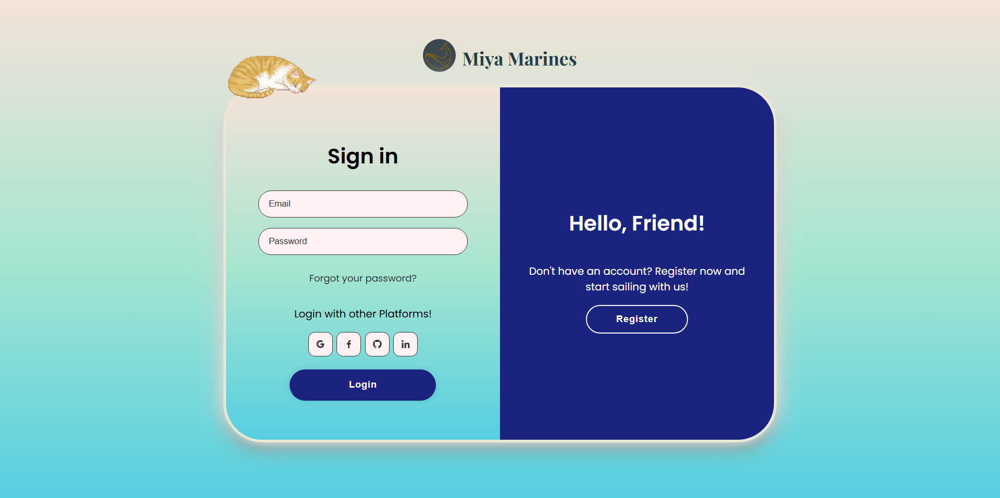
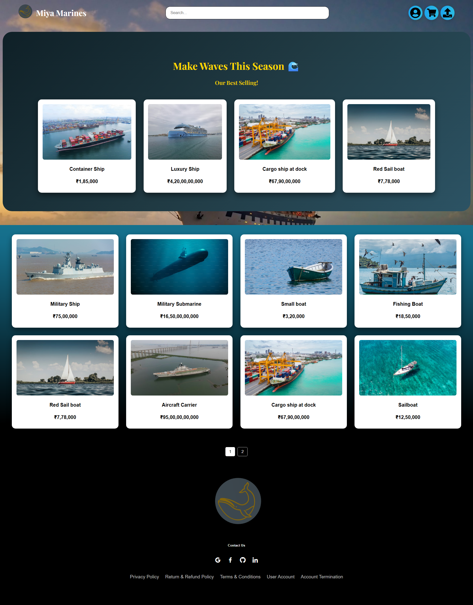
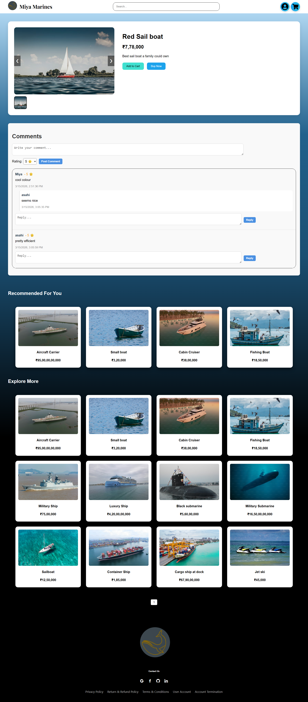
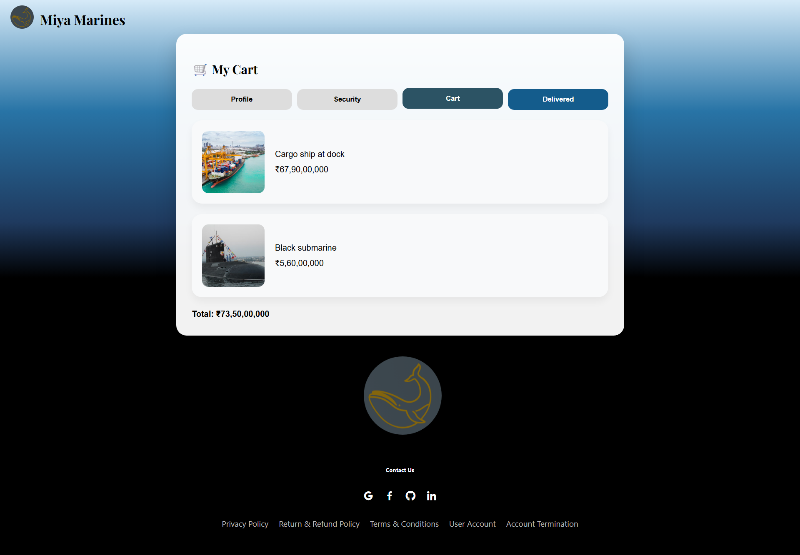
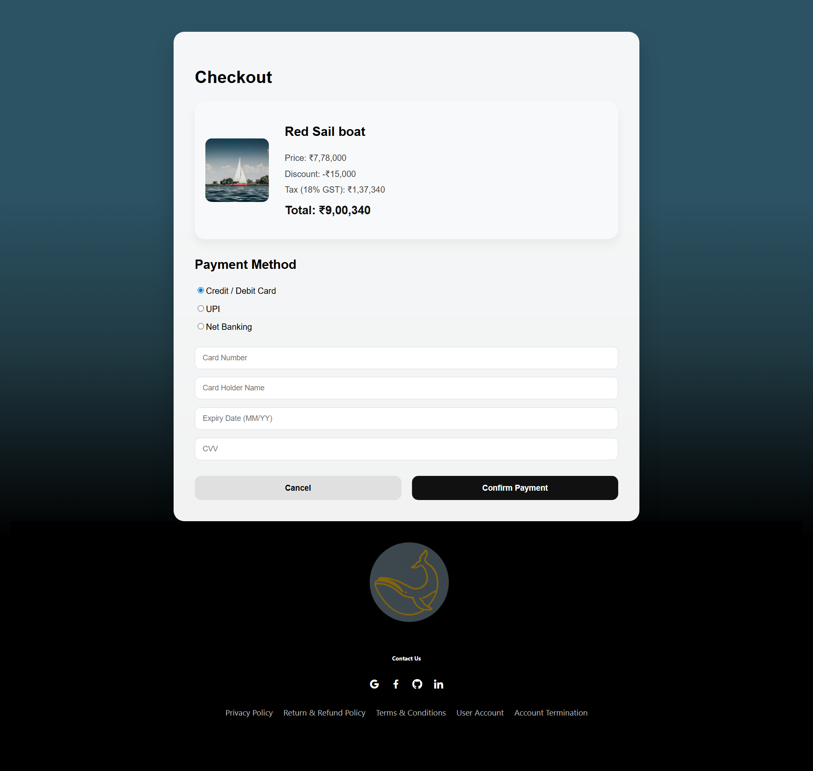

# Miya Marines

Miya Marines is a full-stack ecommerce-style study project built around the idea of selling marine vehicles ranging from rescue boats and luxury vessels to cargo ships, submarines, and aircraft carriers.

It was created mainly as a learning project to explore frontend architecture, backend APIs, authentication, multi-database design, and deployment.

---

# Tech Stack

## Frontend

- React
- Vite

## Backend

- Node.js
- Express.js

## Databases

- Neon PostgreSQL → users, authentication data, orders
- MongoDB Atlas → products, comments

## Deployment

- Backend hosted on Render

---

# Important Deployment Note

The backend is hosted on Render free tier.

Because of free-tier cold starts, the first request may take **30–60 seconds** before the server wakes up.

If the app seems slow at first load, wait briefly and retry.

---

# Main Features

- User registration and login
- Authentication-based protected pages
- Product publishing system
- Product browsing homepage
- Cart system
- Checkout flow
- Buy page
- Account and security sections
- Delivered orders section
- Product comments with rating input

---

# Current Product Types

Miya Marines currently includes listings such as:

- Sale boats
- Finishing boats
- Rescue boats
- Cargo vessels
- Luxury yachts
- Military submarines
- Aircraft carriers

---

# Screenshots

## Hub / Intro Page


## Login Page



## Main Page



## Buy Page



## Cart Page



## Checkout Page



---

# Project Structure Highlights

## PostgreSQL handles

- Users
- Orders
- Authentication-related relational data

## MongoDB handles

- Products
- Product comments
- Flexible product schemas

This split was chosen because product types vary heavily, while user/order relationships benefit from relational structure.

---

# Current Limitations

This project was built primarily for learning, so some systems are intentionally incomplete.

## Authentication

- Username/email/password works
- Passport OAuth (Google / Facebook) currently not fully connected

## Payments

- Payment flow UI exists
- Real payment gateway is not connected yet

## Comments

- Users can comment without purchase verification
- Ratings are added through comments only

## Moderation

- No account blocking/reporting yet
- No product reporting system yet

## Categories

- Product category system not added yet

## Images

- Product publishing currently accepts image links only
- Direct image upload not implemented because free-tier storage was avoided

## Security

- Rate limiter exists but is commented during development for convenience

## Extra Files

- Some backend/frontend files are intentionally prepared for future expansion but not yet connected

---

# Why This Project Exists

This project was made as a practical learning exercise to understand:

- frontend to backend communication
- authentication flow
- API design
- multi-database architecture
- deployment behavior
- feature planning for future scalability

---

# Future Improvements

- OAuth login completion
- Payment gateway integration
- Verified purchase comments
- Product categories and filtering
- Direct image uploads
- Reporting/moderation tools
- Rate limiting in production mode

---

# Running Locally

## Frontend

```bash
npm install
npm run dev
```

## Backend

```bash
npm install
node server.js
```

---

# Note

This is a study-focused project, so the goal was learning architecture and system flow rather than production completeness.

This project is licensed under the GNU General Public License v3.  
Attribution is required: any distributed version must credit the original author (**6Asahi9**) and include a link to the original repository.
